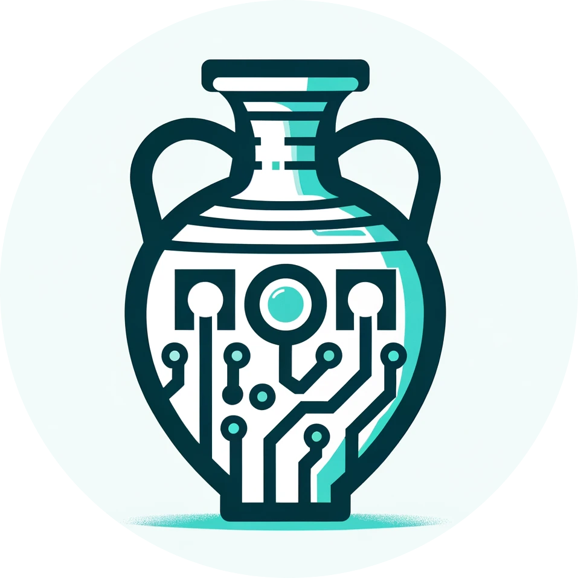

___

    

# Pithos File Format (.pto)

Pithos is the greek name of a large storage container.

Pithos is a packaging file format for arbitrary data that enhances the use of Object Storage for (research) data management. This is done by combining multiple existing file standards with new enhancements. A format specification can be found [[here]](./spec/SPECIFICATION.md).

## Features

- **Encryption**: Pithos implements fast ChaCha20-Poly1305 encryption and enables data exchange compatible to the Crypt4GH standard used for sensitive medical data.
- **Smart Compression**: Via compression probing Pithos can automatically detect and apply fast ZStandard compression for compressible data and optionally skip it when the data is incompressible.
- **Metadata**: Pithos not only includes technical metadata like file size and checksums but can also embed any semantic metadata directly in the file.
- **Indexing**: A built in index allows for fast random access of arbitrary ranges in encrypted and compressed files.
- **Tooling**: Pithos comes with a rich set of existing tools that simplify file handling and can additionally be handled with existing tools for the Crypt4GH and Zstandard file formats.

Pithos comes with two main crates, a library for programmatic use and a CLI application that uses the library:

| crate                      |                                           version                                           |                                 docs                                 |
| :------------------------- | :-----------------------------------------------------------------------------------------: | :------------------------------------------------------------------: |
| [pithos](./crates/pithos/)       |        |        |
| [pithos_lib](./crates/pithos_lib/)       |        |        |

For a more detailed documentation of the individual crates see [Library](./crates/pithos_lib/README.md) and [CLI](./crates/pithos/README.md)